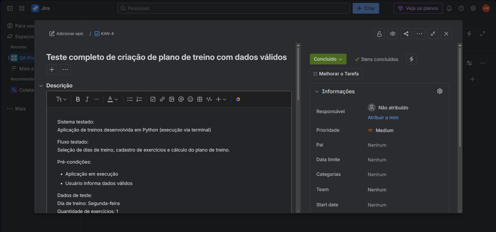

# CT-001 – Criação de plano de treino com dados válidos

## Objetivo
Validar a criação de um plano de treino com dados válidos.

## Pré-condições
Aplicação em execução no terminal.

## Passos
1. Executar o programa
2. Informar dias de treino
3. Informar exercícios
4. Informar valor de 1RM válido

## Resultado esperado
O plano de treino deve ser gerado corretamente.

## Evidência

